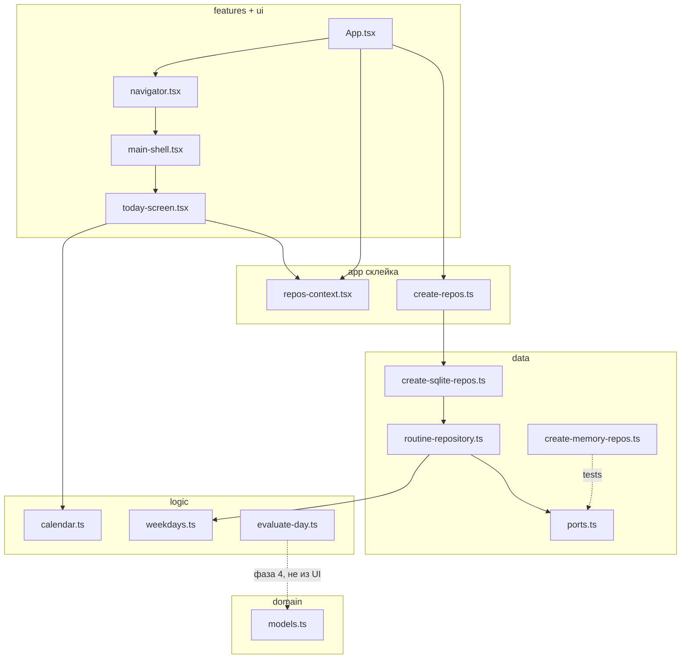
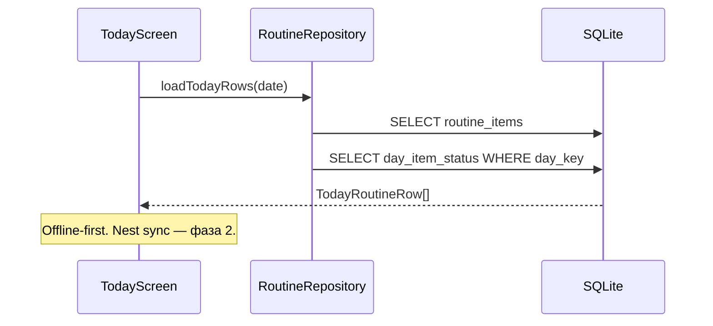

# Архитектура SteadyWeek (RN)

Спека продукта не здесь — она в [`../docs/MASTER_PLAN.md`](../docs/MASTER_PLAN.md). Этот файл про **слои кода**: что можно менять, не переписывая всё остальное.

Flutter-приложение в `flutter-version/` — референс поведения, не шаблон Dart-кода. Активный клиент: `ReactNative-version/frontend/`. API: `ReactNative-version/backend/`.

## Слои (RN)

Зависимости только **вниз**. Экран не импортирует SQLite. SQLite не импортирует React.

```
features/  (экраны, навигация вкладки)
    ↓
app/       (склейка: репозитории, провайдеры, маршруты)
    ↓
data/      (реализации: sqlite; memory — тесты; sync через Nest → Neon — фаза 2)
    ↓
logic/     (оценки, XP, даты, дни недели, время — без React)
    ↓
domain/    (типы и id сущностей)
```

`ui/` — тема, фон, заглушки. Можно перерисовать, не трогая `logic/`.

### Где что лежит

| Папка | Роль |
|--------|------|
| `app/` | Boot, фабрика репозиториев, context, navigator |
| `features/*/` | Один экран (или экран + куски UI) на папку |
| `data/ports.ts` | Контракт хранилища |
| `data/sqlite/` | Одна таблица / один репозиторий ≈ один файл |
| `data/memory/` | Тот же контракт в RAM — для тестов |
| `data/seed/` | Общий сид рутины |
| `logic/` | Чистые функции: день, XP, календарь, битмаска, HH:MM |
| `domain/` | Модели, сферы, тир дня, категории магазина |
| `ui/` | Тема и хром |

## Как менять типичные вещи

| Хочу изменить | Где | Что не трогать |
|----------------|-----|----------------|
| Пороги green/yellow (`R >= 0.5`) | `src/logic/evaluation-config.ts` | экраны, БД |
| Сколько XP за `medium` | `src/logic/economy.ts` | Today, Shop |
| Добавить 7-ю сферу | `src/domain/life-sphere.ts` + строки UI | оценка дня подхватит id |
| Хранение: sqlite → облачный кэш | фабрика в `app/create-repos.ts` | `features/` |
| Облако / логин | Nest API + очередь sync, не экраны | `evaluateDay` |
| Внешний вид Today | `features/today/` | формулы дня |
| Сид первых пунктов | `data/seed/default-routine.ts` | оба адаптера |

## Потоки данных

1. **Рутина** — шаблон на неделю (`RoutineItem` + битмаска дней).
2. **День** — для каждой даты статус пункта: pending / done / skipped.
3. **Закрыть день** — `evaluateDay` (чистая) → XP + тир → запись отчёта + апдейт огонька. UI ещё заглушка (фаза 4).
4. **Неделя** — `weekKey` (понедельник `yyyy-MM-dd`) + цели; CRUD целей — фаза 4.
5. **Магазин** — типы в `domain/shop.ts`; каталог и владение — фаза 5.

## Фазы (см. [`DEV_PLAN.md`](./DEV_PLAN.md))

| Фаза | Статус | Что |
|------|--------|-----|
| **0 — Каркас** | done | RN shell, Nest `/health`, этот документ |
| **1 — Рабочее ядро** | done | SQLite за `ports.ts`, CRUD рутины, Today с отметками |
| **2+** | planned | Nest + Neon sync, ассистент, XP, MCP |

Репозитории клиента: **`sqlite`**. `memory` — тот же порт для тестов. Интерфейсы в `data/ports.ts` не меняются при смене хранилища.

## Данные: SQLite + Nest/Neon (не Supabase)

| Где | Что |
|-----|-----|
| **Телефон / Web** | SQLite через `expo-sqlite` — UI всегда читает отсюда |
| **Облако (фаза 2+)** | NestJS → Neon PostgreSQL — бэкап, второй девайс, MCP |
| **Не используем** | Supabase, MongoDB, прямой Groq из клиента |

Схема клиента и сервера в будущем максимально одинаковая (`id`, `updated_at`, `deleted_at`). Конфликты v1: last-write-wins.

## Чего сознательно нет в первой рабочей версии

- IAP / донаты
- In-app Groq без Nest (ключ не в клиенте)
- Live-merge двух устройств
- Серверный push
- MongoDB / Supabase (облако = Nest + Neon)

## Схемы




